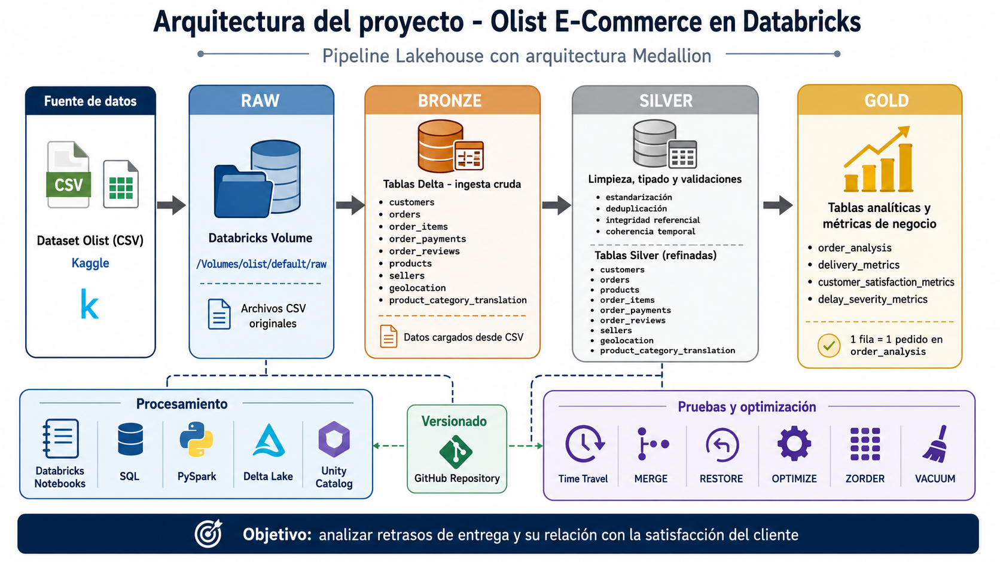

# Olist E-Commerce Data Engineering Project

[Versión en español](README_ES.md)

Hands-on Data Engineering project built in **Databricks** using the **Brazilian E-Commerce Public Dataset by Olist**.

The project implements a **Raw → Bronze → Silver → Gold** Lakehouse pipeline to transform raw CSV files into validated Delta tables and analytical datasets focused on delivery performance and customer satisfaction.

## Objective

Build a Medallion-style data pipeline to analyze the order lifecycle and identify factors associated with:

- delivery delays;
- negative customer reviews;
- delivery performance;
- customer satisfaction.

The project is intended as a practical Data Engineering portfolio project, with emphasis on data ingestion, transformation, quality controls, modeling, Delta Lake capabilities and analytical data delivery.

## Business question

**How are delivery delays associated with customer satisfaction in the Olist e-commerce dataset?**

The analysis is observational: the results show associations in the historical dataset and should not be interpreted as proof of causality.

## Architecture



### Raw

Original CSV files stored in a **Databricks Volume**.

### Bronze

Raw datasets ingested as **Delta tables**, preserving the source structure for downstream processing.

### Silver

Refined datasets with:

- data type standardization;
- cleaning and deduplication;
- data quality validations;
- referential integrity checks;
- temporal consistency checks;
- preparation of reusable business entities.

### Gold

Analytical tables and business metrics prepared for delivery and customer satisfaction analysis.

Main Gold outputs include:

- `order_analysis`
- `delivery_metrics`
- `customer_satisfaction_metrics`
- `delay_severity_metrics`

## Tech stack

- Databricks
- Apache Spark
- PySpark
- Spark SQL / SQL
- Delta Lake
- Unity Catalog
- Git / GitHub

## Dataset

**Brazilian E-Commerce Public Dataset by Olist**

Source: [Kaggle — Brazilian E-Commerce Public Dataset by Olist](https://www.kaggle.com/datasets/olistbr/brazilian-ecommerce)

The dataset contains information about:

- orders;
- customers;
- sellers;
- products;
- payments;
- reviews;
- geolocation;
- product category translations.

## Pipeline

```text
Olist CSV files
      │
      ▼
     RAW
Original files in Databricks Volume
      │
      ▼
   BRONZE
Raw Delta tables
      │
      ▼
   SILVER
Cleaning, typing, validation and refined entities
      │
      ▼
    GOLD
Analytical tables and business metrics
```

## Data quality

The Silver layer includes controls focused on making the analytical datasets more reliable before creating Gold tables.

Examples include:

- standardization of data types and values;
- duplicate handling;
- null and consistency checks;
- referential integrity validation;
- temporal coherence validation;
- validation of relationships between orders, customers, products, payments and reviews.

## Main analytical results

The project analyzed **99,441 orders**.

Key observations:

- **6.77%** of orders with delivery information were delayed.
- Average delivery time: **12.5 days**.
- Average delay among late orders: **10.62 days**.
- Average review score for orders without delay: **4.29**.
- Average review score for delayed orders: **2.27**.
- Negative reviews for orders without delay: **9.31%**.
- Negative reviews for delayed orders: **62.46%**.

These results show a strong association between delivery delays and worse customer reviews in the analyzed dataset.

### Negative reviews by delivery status

```text
Without delay:  9.31%
Delayed:       62.46%
```

The detailed Gold analysis also explores how the proportion of negative reviews changes as delay severity increases.

## Delta Lake capabilities

The project includes practical tests and demonstrations of Delta Lake functionality, including:

- Transaction Log
- Time Travel
- `UPDATE`
- `DELETE`
- `RESTORE`
- `MERGE`
- `OPTIMIZE`
- `ZORDER`
- `VACUUM`

These tests were used to understand table versioning, recovery, incremental update patterns and storage/query optimization concepts in Delta Lake.

## Repository structure

```text
Brazilian-E-Commerce/
├── Notebooks/
│   ├── 00_setup
│   ├── 01_data_exploration
│   ├── 02_bronze_ingestion
│   ├── 03_data_quality_analysis
│   ├── 04_silver_customers
│   ├── 05_silver_orders
│   ├── 06_silver_products
│   ├── 07_silver_other_tables
│   ├── 08_gold_business_metrics
│   ├── 09_delta_lake_tests
│   └── 10_optimization
│
├── docs/
│   └── image/
│       └── Architecture.png
│
├── README.md
└── README_ES.md
```

## Recommended notebook flow

The notebooks follow the pipeline lifecycle:

1. Environment and catalog setup.
2. Initial data exploration.
3. Bronze ingestion.
4. Data quality analysis.
5. Silver transformations by business entity.
6. Gold analytical tables and metrics.
7. Delta Lake functionality tests.
8. Optimization tests.

## What this project demonstrates

This project was built to practice and demonstrate:

- Lakehouse and Medallion architecture concepts;
- data ingestion with Databricks;
- distributed transformations with PySpark;
- SQL-based data processing;
- Delta Lake table management;
- data quality validation;
- relational data modeling;
- analytical dataset construction;
- Git/GitHub version control;
- translating raw data into business-oriented metrics.

## Author

**Nicolás Rojas Díaz**

- GitHub: [Niicolas-Rojas](https://github.com/Niicolas-Rojas)
- LinkedIn: [Nicolás Rojas Díaz](https://www.linkedin.com/in/nicolas-rojass/)
- Portfolio: [niicolas-rojas.github.io](https://niicolas-rojas.github.io/)
